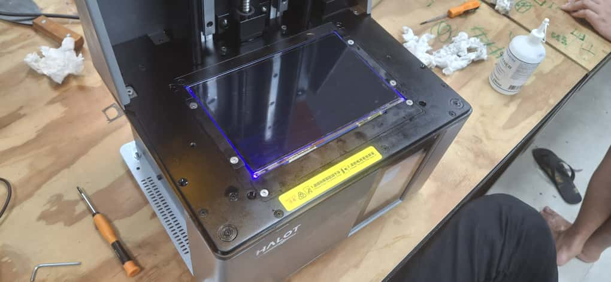
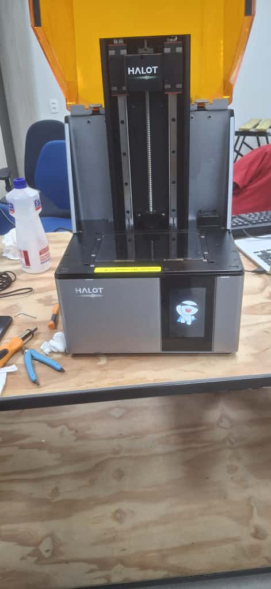

# 🛠️ Manutenção da Impressora 3D Creality Halot

Este repositório documenta o processo de **desmontagem, inspeção, limpeza e remontagem** da impressora 3D de resina **Creality Halot**, realizado como prática de engenharia aplicada.  
O objetivo é registrar o procedimento técnico, auxiliar outros usuários e servir como portfólio de manutenção de hardware.

---

## 📌 Objetivos
- Diagnosticar possíveis falhas mecânicas, eletrônicas e ópticas.  
- Realizar manutenção preventiva (limpeza e lubrificação).  
- Documentar o processo com fotos e relatórios.  
- Garantir maior vida útil ao equipamento.  

---

## 🧾 Procedimento Técnico

### 1. Remoção da tampa e display
Primeiro passo foi desmontar a tampa frontal e desconectar a tela LCD de exposição.  

---

### 2. Acesso ao compartimento interno
Abertura do compartimento interno, expondo o **espelho de refração e eletrônica principal**.  

---

### 3. Inspeção da fonte de energia
Teste da fonte de alimentação para verificar a saída de 24V e possíveis falhas.  

---

### 4. Manutenção traseira
Limpeza dos coolers, área traseira e filtros de ar, responsáveis pela ventilação e dissipação de calor.  

---

### 5. Teste da matriz de LEDs UV
Verificação do funcionamento da matriz de LEDs UV responsável pela cura da resina.  

---

### 6. Re-montagem e teste final
Após a manutenção e inspeção, a impressora foi remontada e ligada com sucesso.  

---

## ✅ Resultados
- Impressora remontada com sucesso.  
- Ventilação interna limpa e funcional.  
- Fonte de alimentação testada e aprovada.  
- LEDs UV operando corretamente.  
- Sistema pronto para impressão de validação.  

---

## ⚠️ Problemas Encontrados
- **Cabo flat** da tela LCD apresentava desgaste (risco de falha futura).  
- Poeira acumulada em coolers e filtros.  
- Pequenos resíduos de resina endurecida no interior.  

---

## 📚 Aprendizados
- Importância da **manutenção preventiva** para evitar falhas críticas.  
- Necessidade de verificar regularmente o **cabo flat e conexões frágeis**.  
- Sistema de ventilação é essencial para durabilidade dos LEDs UV.  
- Documentação fotográfica é fundamental para replicar o processo.  

---

## 🔗 Estrutura do Repositório
- `README.md` → Este documento.  
- `UVok.jpg` → Teste da matriz de LEDs UV.  
- `compartimento interno e espeiho de refração.jpg` → Inspeção óptica e eletrônica interna.  
- `conferindo a fonte.jpg` → Teste da fonte de alimentação.  
- `ligou.jpg` → Teste final da impressora.  
- `manutançao traseira.jpg` → Limpeza da parte traseira e ventilação.  
- `tampa frontao e dysplay.jpg` → Remoção da tampa e tela LCD.  
